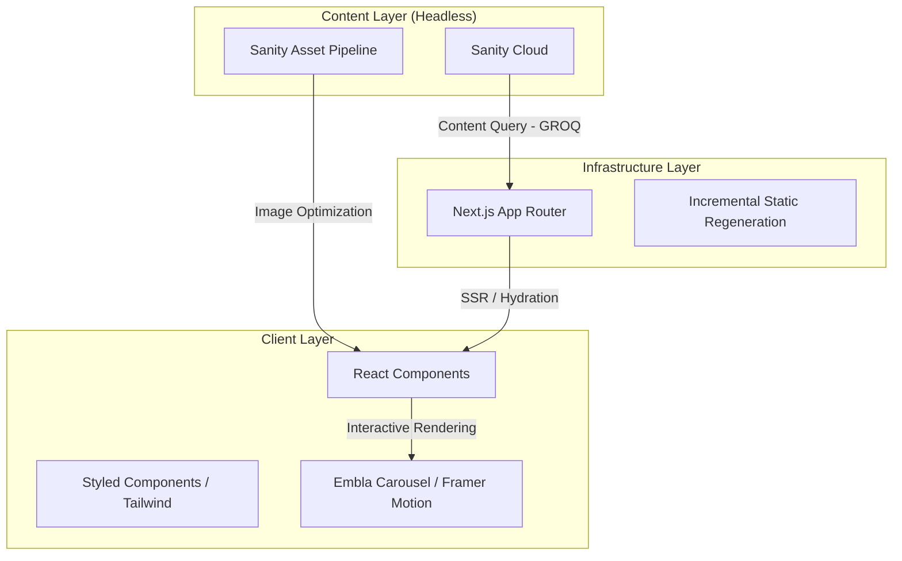

# <p align="center">AddaReady: Professional Portfolio Engine</p>

<p align="center">
  <strong> An automated web deployment system for professional branding and high-performance interactive catalogs.</strong>
</p>

<p align="center">
  
  
  
  
</p>

---

## 🚀 Overview

**AddaReady** is a modern web application designed for professional digital crafting. It leverages a **Headless CMS architecture** paired with **Next.js's App Router** to deliver a seamless management experience for service catalogs and portfolios.

This project focuses on:
- **Component-Driven Development**: Modular UI building using React and Tailwind.
- **Dynamic Content Management**: Real-time updates via Sanity Studio.
- **High Performance**: Optimized Core Web Vitals (LCP, FID, CLS) through Next.js server-side features.

---

## 🏗️ System Architecture

The following diagram illustrates the technical ecosystem of AddaReady, showing the lifecycle of data from the CMS to the end-user.



---

## 🛠️ Technology Stack

| Layer          | Technology                     | Description                                      |
|----------------|--------------------------------|--------------------------------------------------|
| **Core**       | Next.js 15+                    | React framework for production-grade SSR/ISR.    |
| **CMS**        | Sanity.io                      | Decoupled content management for structured data.|
| **Styling**    | Tailwind CSS v4                | Utility-first CSS for rapid UI development.      |
| **Components** | Radix UI / Styled Components   | Unstyled primitives with custom CSS-in-JS.       |
| **Dynamics**   | Embla Carousel                 | Lightweight carousel logic for package showcase. |
| **Icons**      | Lucide React                   | Flexible, high-quality iconography.             |

---

## 📊 Data Schema: Template Model

The core entity in this system is the `template` document, which defines the attributes for each portfolio service.

```typescript
// Location: /sanity/schemaTypes/template.ts
export default {
  name: 'template',
  fields: [
    { name: 'title', type: 'string' },        // Service naming
    { name: 'slug', type: 'slug' },         // URL SEO optimization
    { name: 'tech_stack', type: 'array' },   // Tech stack identifiers
    { name: 'thumbnail', type: 'image' },    // Visual representation
    { name: 'demo_url', type: 'url' },       // External performance link
    { name: 'category', type: 'string' },    // Pricing tiers (Good, Impressive, Excellent)
  ]
}
```

---

## ✨ Key Technical Highlights

- **Server-Side Rendering (SSR)**: Ensures high SEO visibility for portfolio items.
- **Image Optimization**: Automatic resizing and WebP conversion via Sanity Image Pipeline.
- **Responsive Fluidity**: Custom design tokens integrated into Tailwind v4 for multi-device support.
- **Type Safety**: End-to-end typing from Sanity schema to React props using TypeScript.

---

<p align="center">
  <small>© 2024 AddaReady Studio. Managed with precision for professional excellence.</small>
</p>